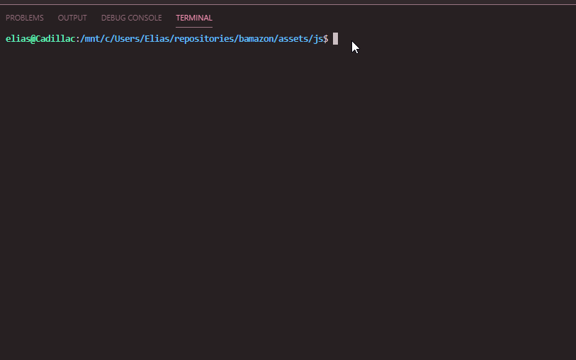
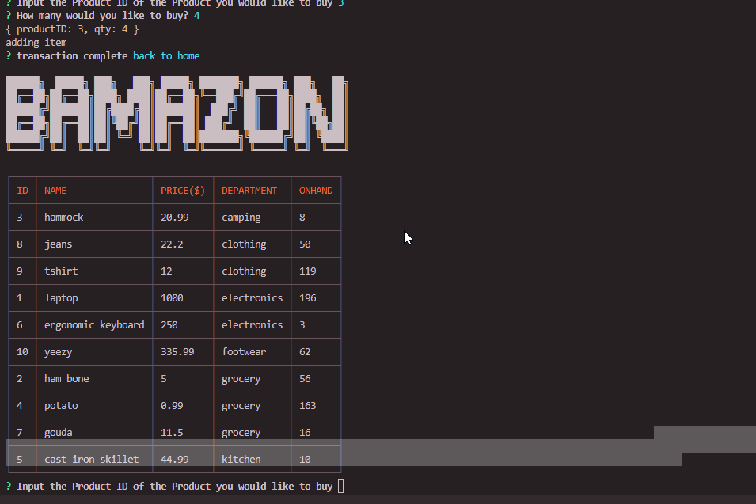
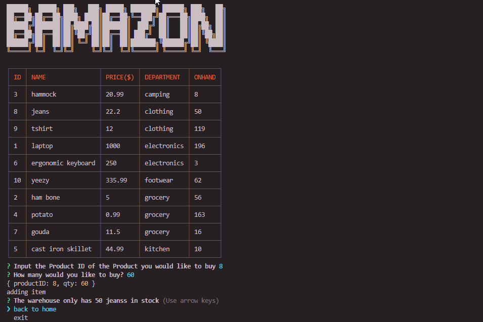

# bamazon
## node.js and SQL powered amazon clone

BAMAZON

Technologies used:

* Node.js

Dependencies:
* inquirer
* mysql
* cli-table
  

### How to use

1. Clone the bamazon.js repository
2. run ```npm install``` to install the required dependencies
3. run the application by running ```node bamazonCustomer.js```

4. Input the Product ID of the product you would like to buy.
5. Enter how many you would like to buy
    * If you request more product than is available an error message will display and the transaction will fail
    ;
6. Select "Back to home" or "exit" after the transacation has completed (or failed)
   * ;
